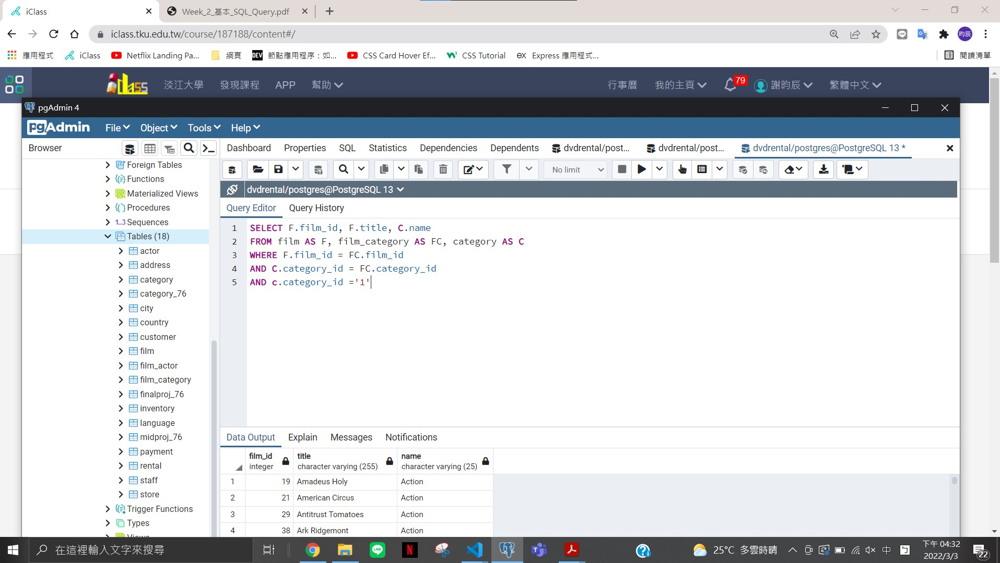
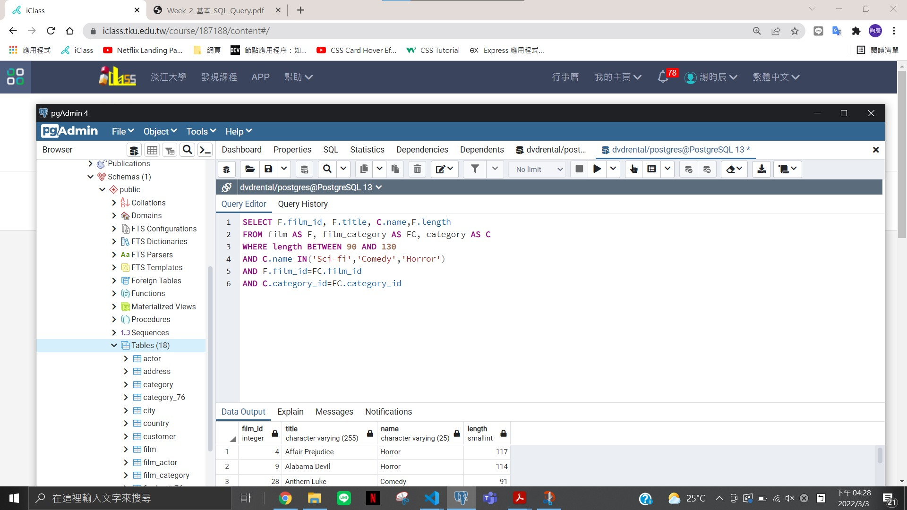

####練習 1---使⽤ dvdrental Database 列出所有動作⽚（Action）的 ID、⽚名以及其種類名稱 （請務必按照順序呈現）


```
SELECT F.film_id, F.title, C.name
FROM film AS F, film_category AS FC, category AS C
WHERE F.film_id = FC.film_id
AND C.category_id = FC.category_id
AND c.category_id ='1'

```

####練習 3---使⽤ dvdrental Database，列出所有⽚⻑（length）介於 90 ⾄ 130 分鐘的科幻⽚（Scifi）、喜劇⽚（Comedy）以及恐怖⽚（Horror）其⽚名、⽚⻑及種類


```
SELECT F.film_id, F.title, C.name,F.length
FROM film AS F, film_category AS FC, category AS C
WHERE length BETWEEN 90 AND 130
AND C.name IN('Sci-fi','Comedy','Horror')
AND F.film_id=FC.film_id
AND C.category_id=FC.category_id

```
