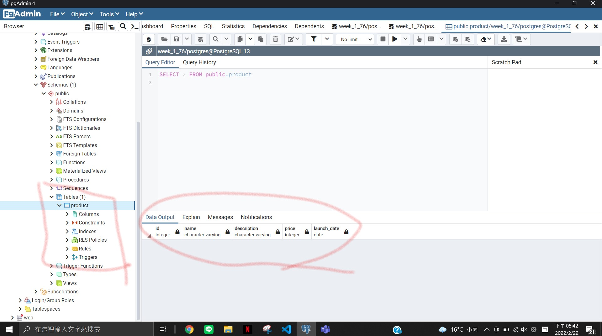
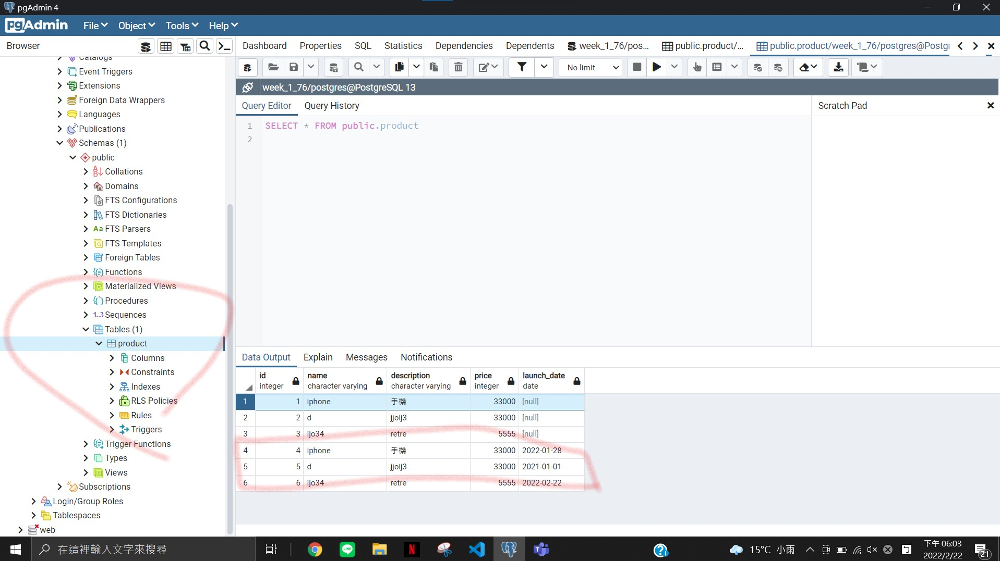

###w1(111/2/22)

P1


SQL

### TA create Table

```
CREATE TABLE product(
	id serial,
	name varchar,
	description character varying,
	price integer,
	launch_date date
)

```



### TA INSERT INTO date

```
INSERT INTO product(name,description,price,launch_date)
VALUES('iphone','手機',33000,'2022-01-28'),('d','jjoij3',33000,'2021-01-01'),('ijo34','retre',5555,'2022-02-22')

```
