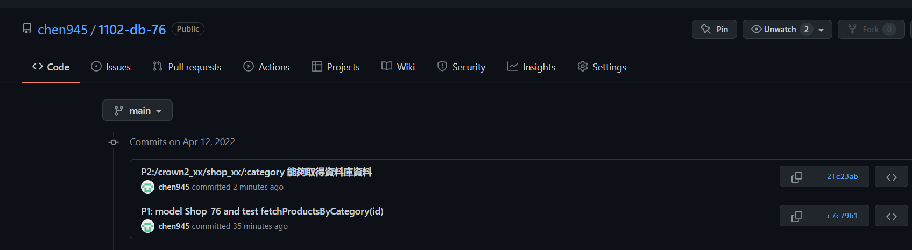
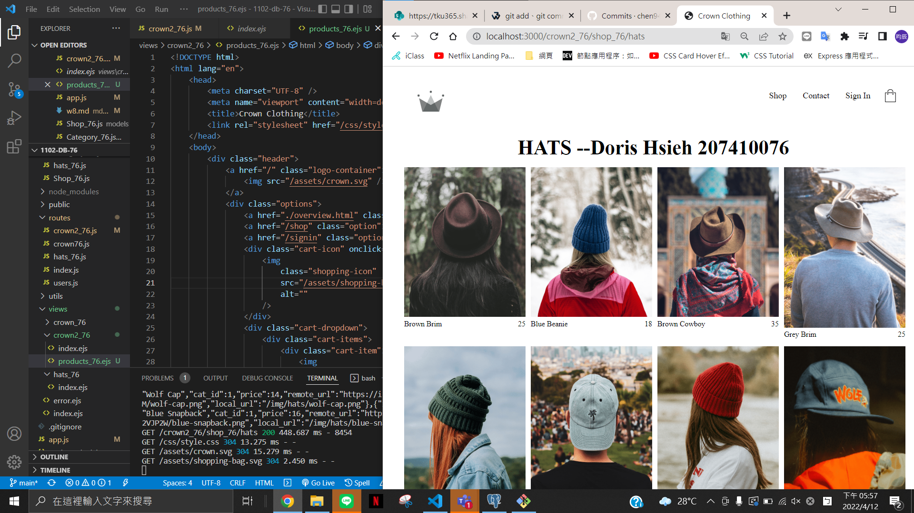
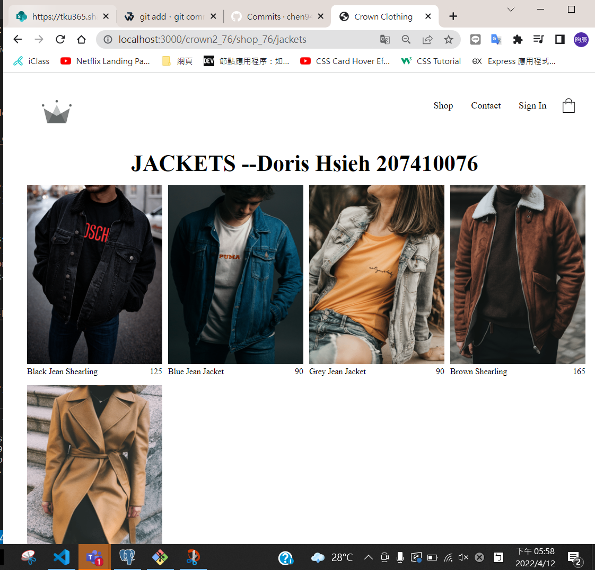
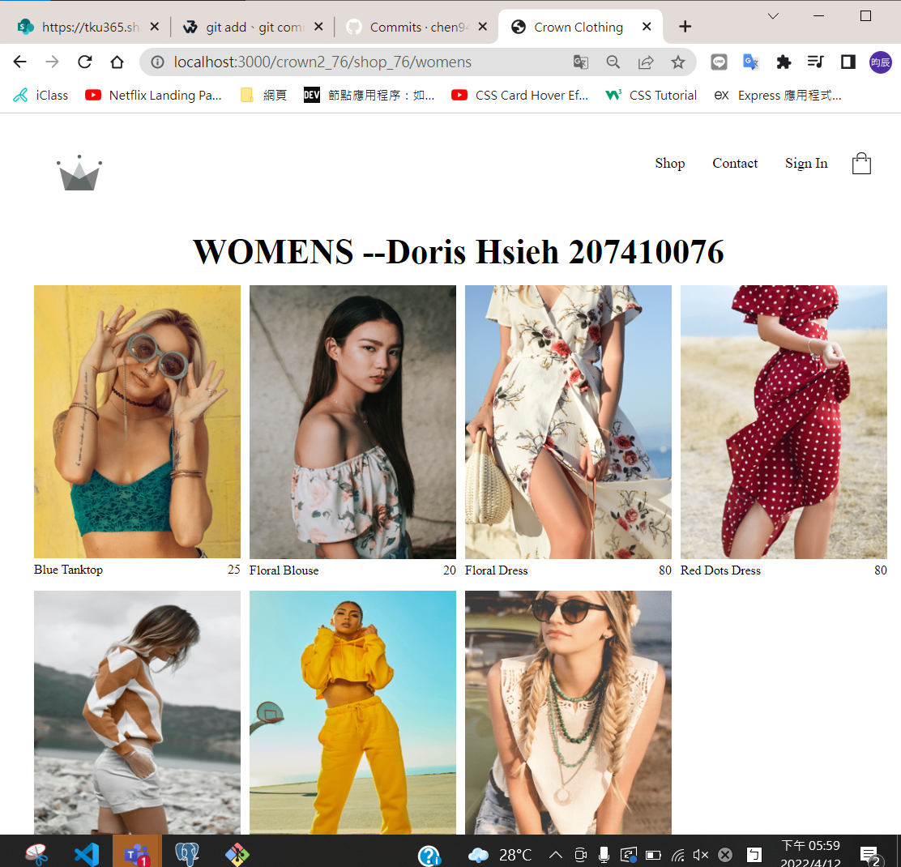
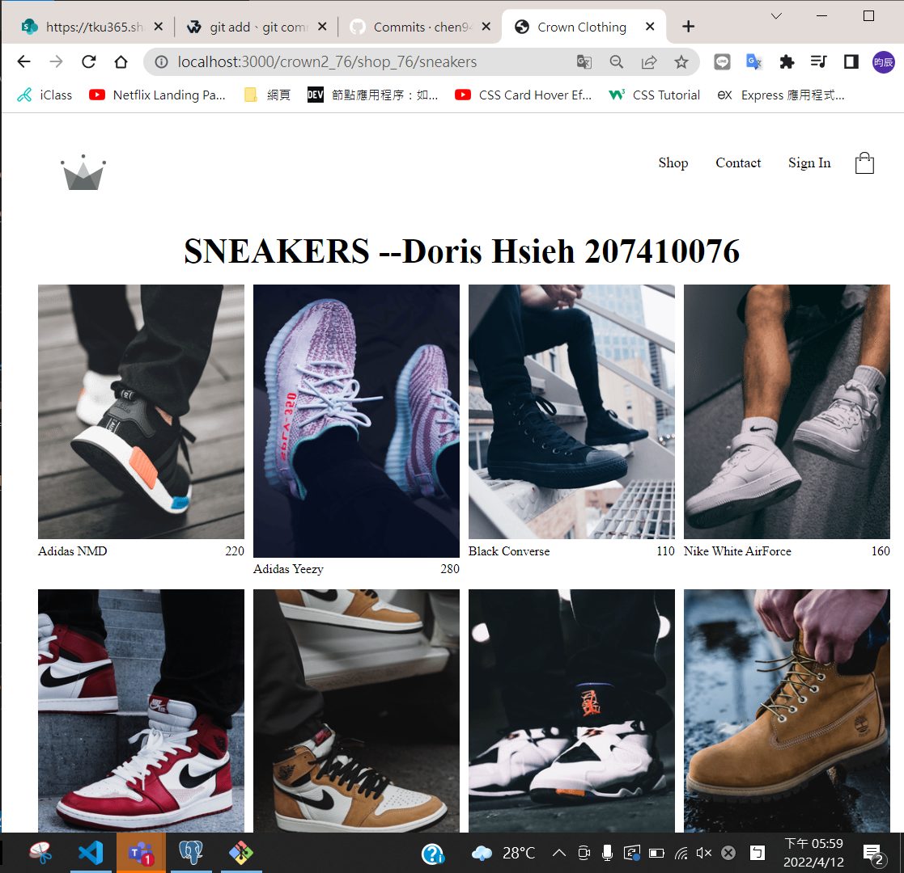
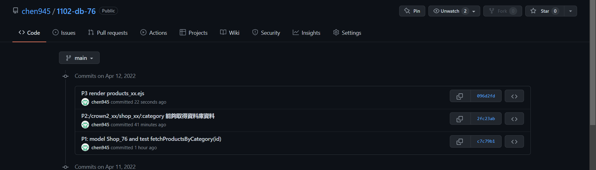

#### P1: model Shop_76 and test fetchProductsByCategory(id)

#### P1-1: Github log message of P1

#### P2:/crown2_xx/shop_xx/:category 能夠取得資料庫資料

#### P2-1: Github log message of P2

#### P3 render products_xx.ejs

#### P3-1: Github log message of P2

