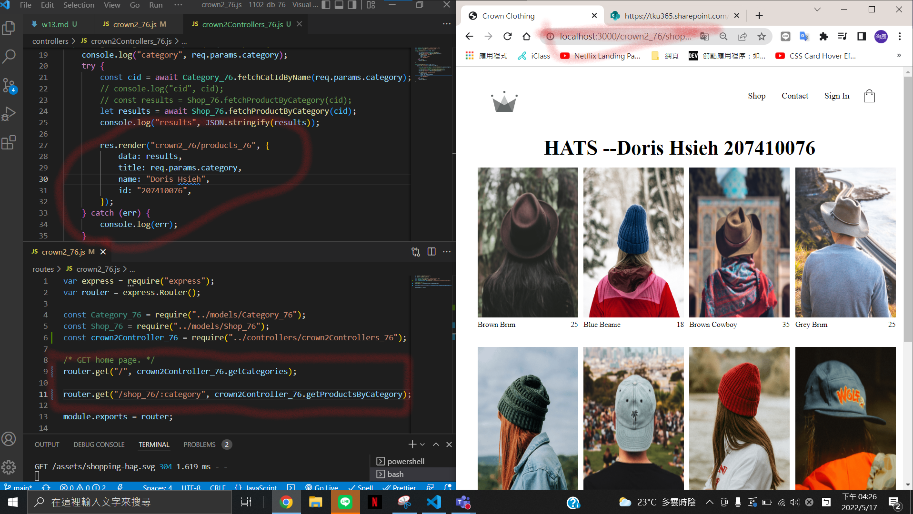
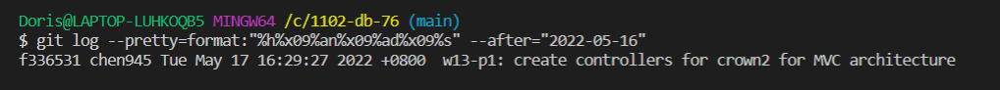
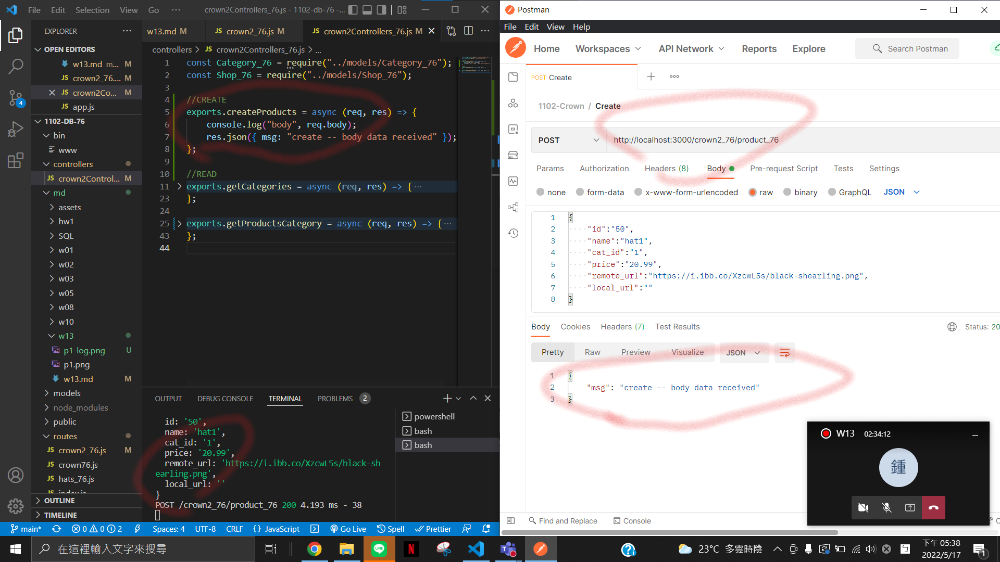

### w13-p1: create controllers for crown2 for MVC architecture




```
$ git log --pretty=format:"%h%x09%an%x09%ad%x09%s" --after="2022-05-16"
f336531 chen945 Tue May 17 16:29:27 2022 +0800  w13-p1: create controllers for crown2 for MVC architecture
```

### w13-p2 use Postman to test product body data can be retrieved using route /crown2_xx/product_xx


