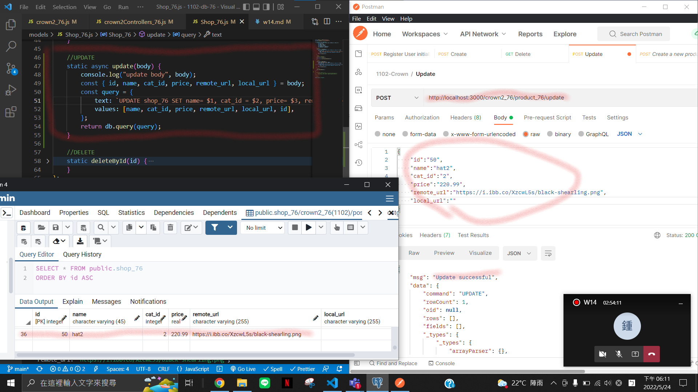

### Github URL

GITHUB_URL : https://github.com/chen945/1102-db-76

### w14-p1: save a product to postgreSQL server, show code and new data in pgAdmin


### w14-p2: delete a product using route /product_xx/:id


## w14-p3: update a product using route /product_xx/update/:id



### Log

```
$ git log --pretty=format:"%h%x09%an%x09%ad%x09%s" --after="2022-05-23"
```
