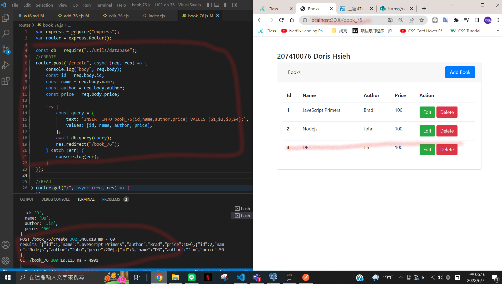
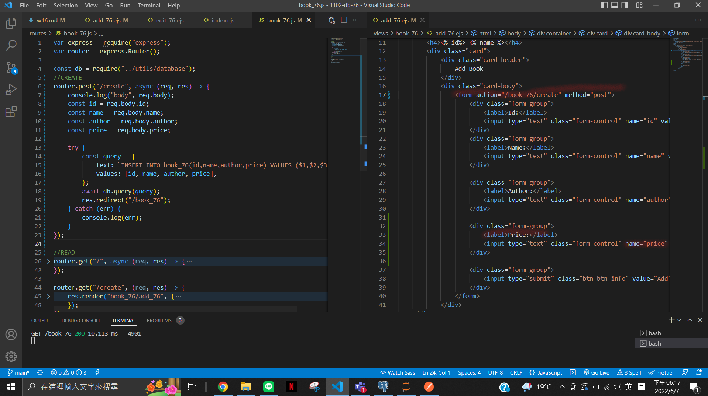
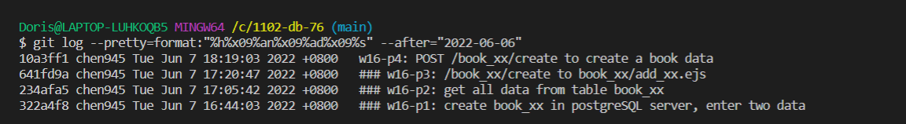

### w16-p1: create book_xx in postgreSQL server, enter two data


### w16-p2: get all data from table book_xx


### w16-p3: /book_xx/create to book_xx/add_xx.ejs


### w16-p4: POST /book_xx/create to create a book data




### last log



```
$ git log --pretty=format:"%h%x09%an%x09%ad%x09%s" --after="2022-06-06"
10a3ff1 chen945 Tue Jun 7 18:19:03 2022 +0800   w16-p4: POST /book_xx/create to create a book data
641fd9a chen945 Tue Jun 7 17:20:47 2022 +0800   ### w16-p3: /book_xx/create to book_xx/add_xx.ejs
234afa5 chen945 Tue Jun 7 17:05:42 2022 +0800   ### w16-p2: get all data from table book_xx
322a4f8 chen945 Tue Jun 7 16:44:03 2022 +0800   ### w16-p1: create book_xx in postgreSQL server, enter two data
```
