### 1.先創一個 shop_76 的 ROUTES 並按老師的範例建立 CRUD，及相關 shop_76 資料庫

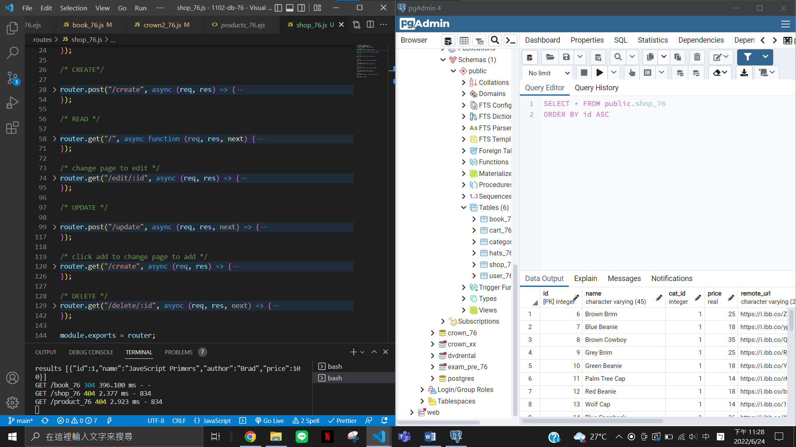

### 2. view/shop_76/index.ejs，並確認可以顯示出資料庫的資料

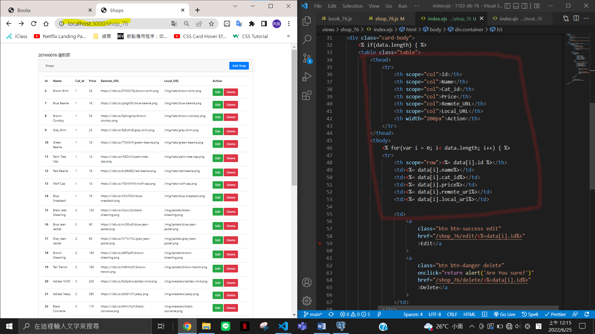

### 3.建立 view/shop_76/add & edit

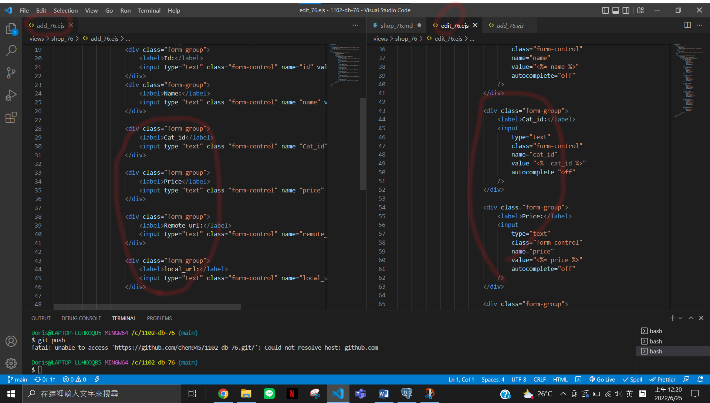

### 4.確認可以 create 成功

CREATE 畫面:
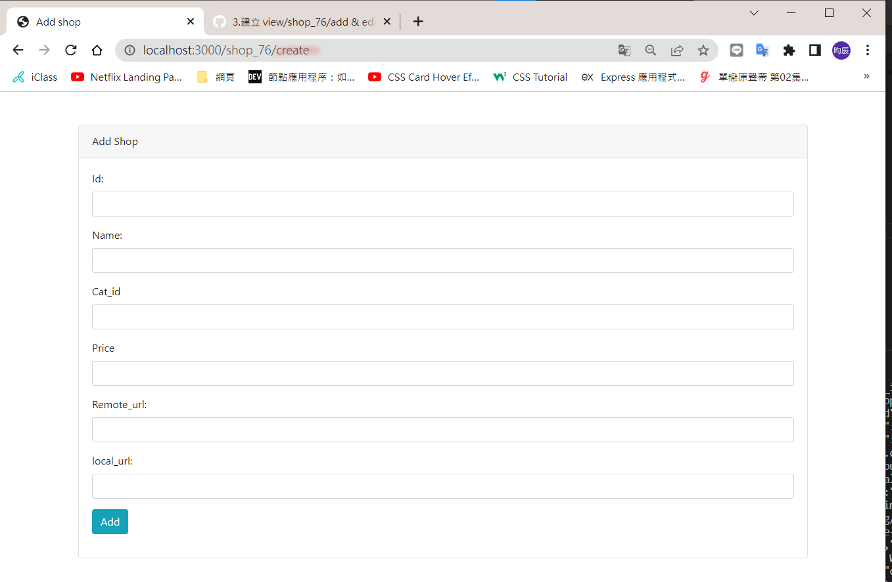

確定可新建成功
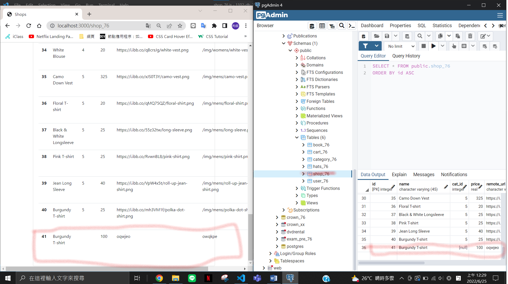
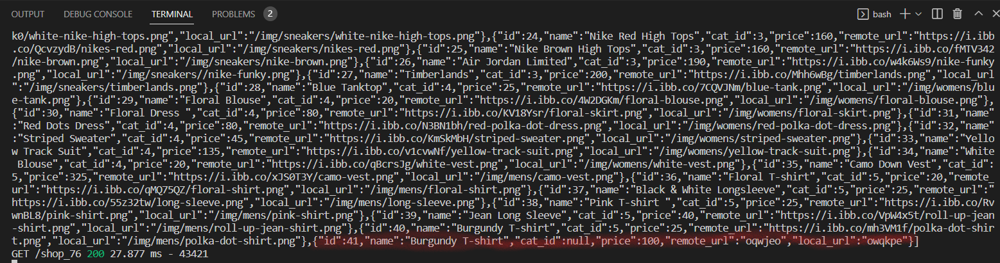

### 5.確認可以修改資料成功

Edit 畫面(修改資料)
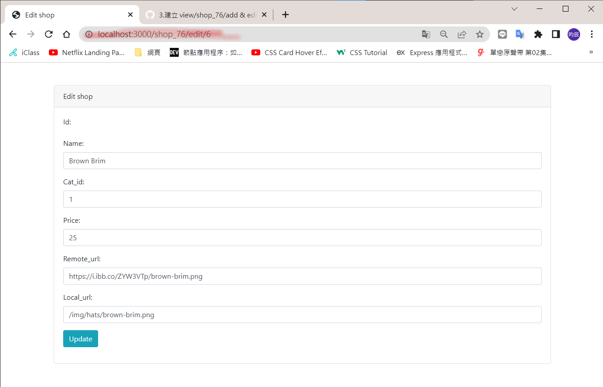

確定可以修改成功

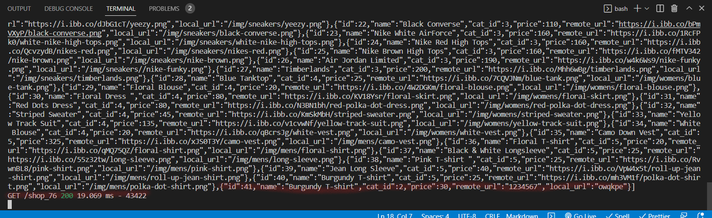

### 6.Delete 成功

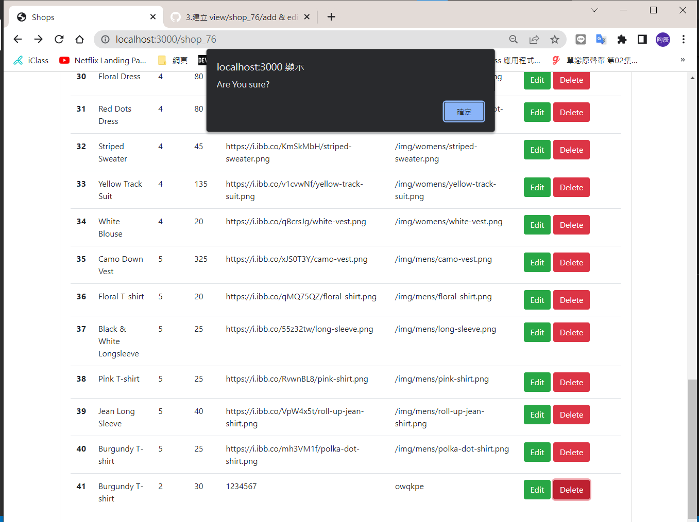
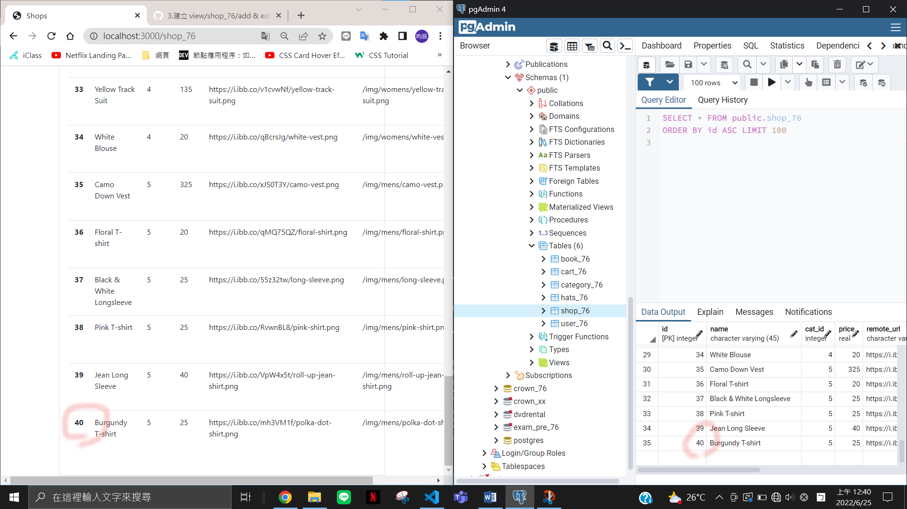
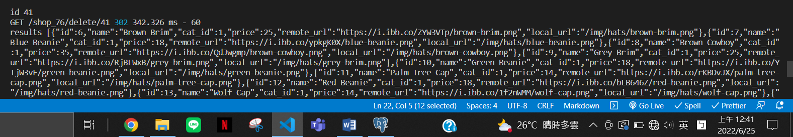
