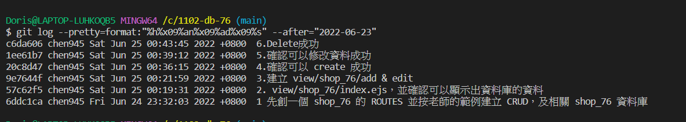

### 1.先創一個 shop_76 的 ROUTES 並按老師的範例建立 CRUD，及相關 shop_76 資料庫


### 2. view/shop_76/index.ejs，並確認可以顯示出資料庫的資料


### 3.建立 view/shop_76/add & edit


### 4.確認可以 create 成功

CREATE 畫面:


確定可新建成功


### 5.確認可以修改資料成功

Edit 畫面(修改資料)


確定可以修改成功


### 6.Delete 成功


### last log



```
$ git log --pretty=format:"%h%x09%an%x09%ad%x09%s" --after="2022-06-23"
c6da606 chen945 Sat Jun 25 00:43:45 2022 +0800  6.Delete成功
1ee61b7 chen945 Sat Jun 25 00:39:12 2022 +0800  5.確認可以修改資料成功
20c8d47 chen945 Sat Jun 25 00:36:15 2022 +0800  4.確認可以 create 成功
9e7644f chen945 Sat Jun 25 00:21:59 2022 +0800  3.建立 view/shop_76/add & edit
57c62f5 chen945 Sat Jun 25 00:19:31 2022 +0800  2. view/shop_76/index.ejs，並確認可以顯示出資料庫的資料
6ddc1ca chen945 Fri Jun 24 23:32:03 2022 +0800  1 先創一個 shop_76 的 ROUTES 並按老師的範例建立 CRUD，及相關 shop_76 資料庫
```
