### w17-p1: create user_xx in postgreSQL server, enter two data, the first one is about your

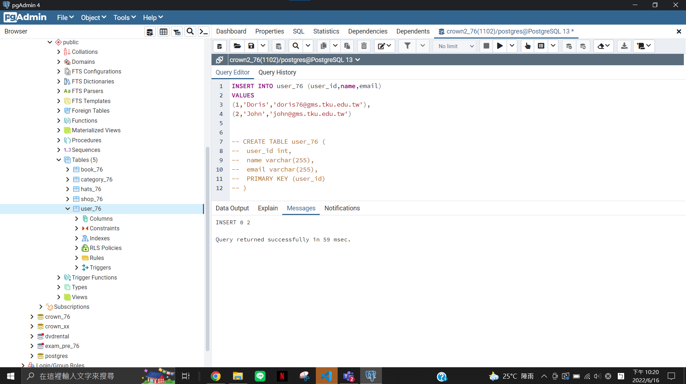
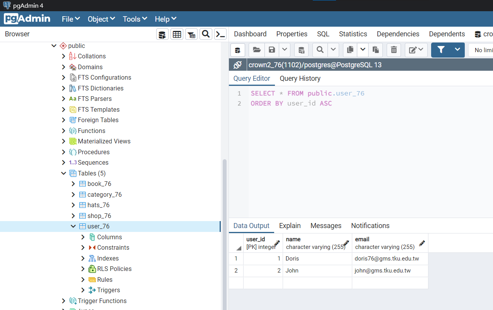

### w17-p2: create cart_xx in postgreSQL server, enter five data, one for each category

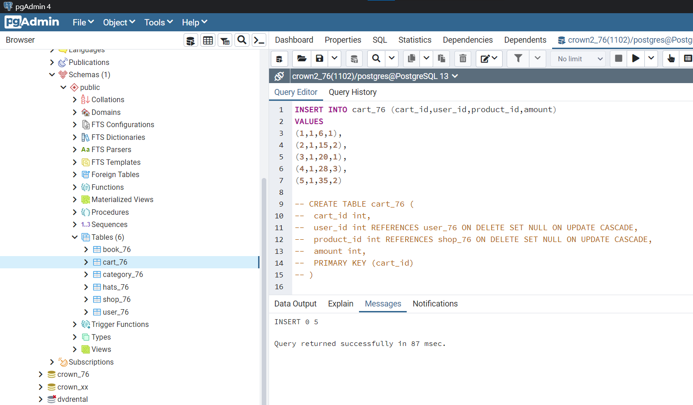


### w17-p3: give query to get related data for cart info shown in ejs

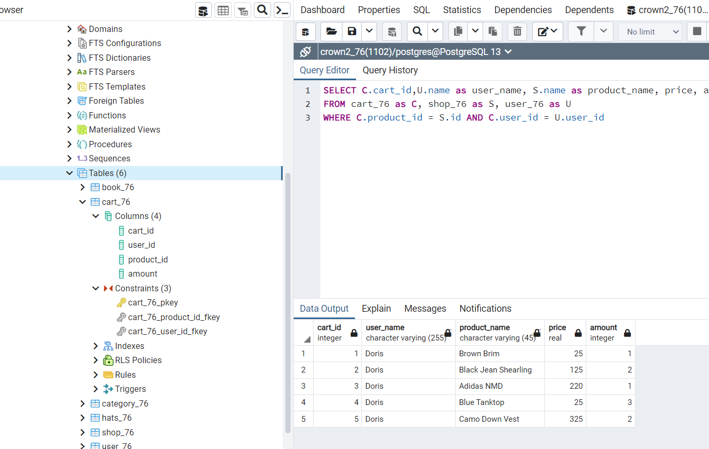

### w17-p4: insert data in order to violate the key constraints, foreign key constraints

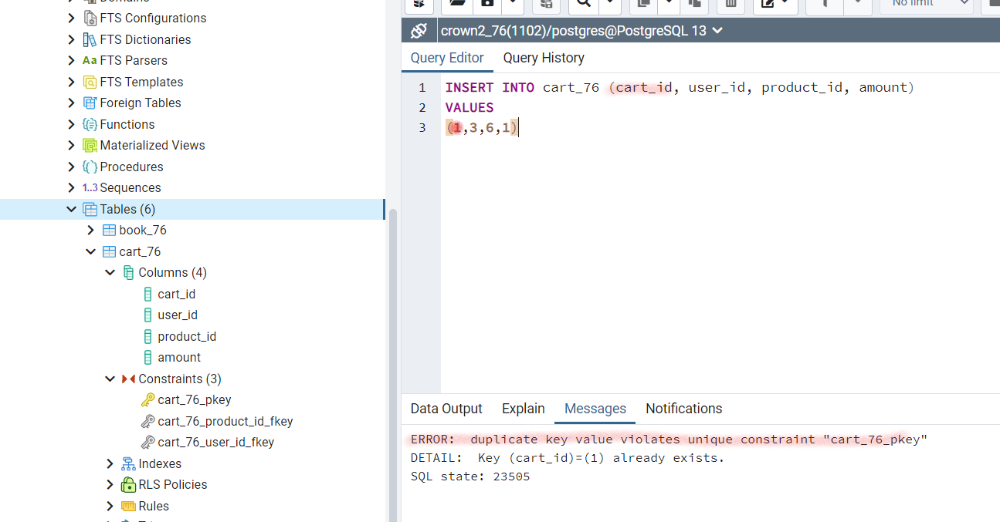
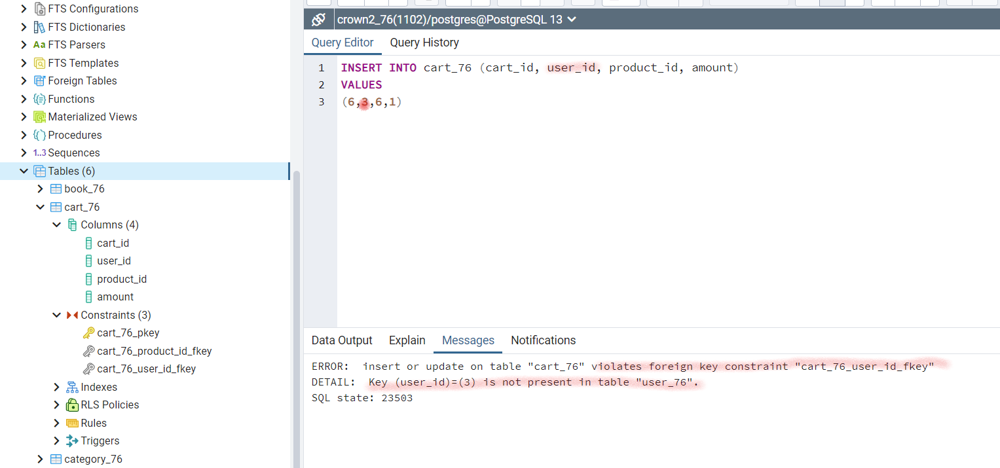
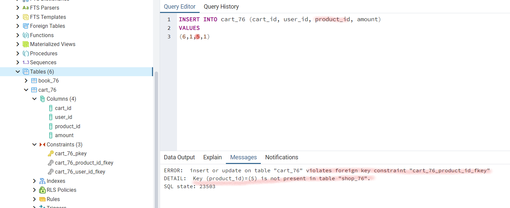

### w17-p5.1: test ON UPDATE CASCASE

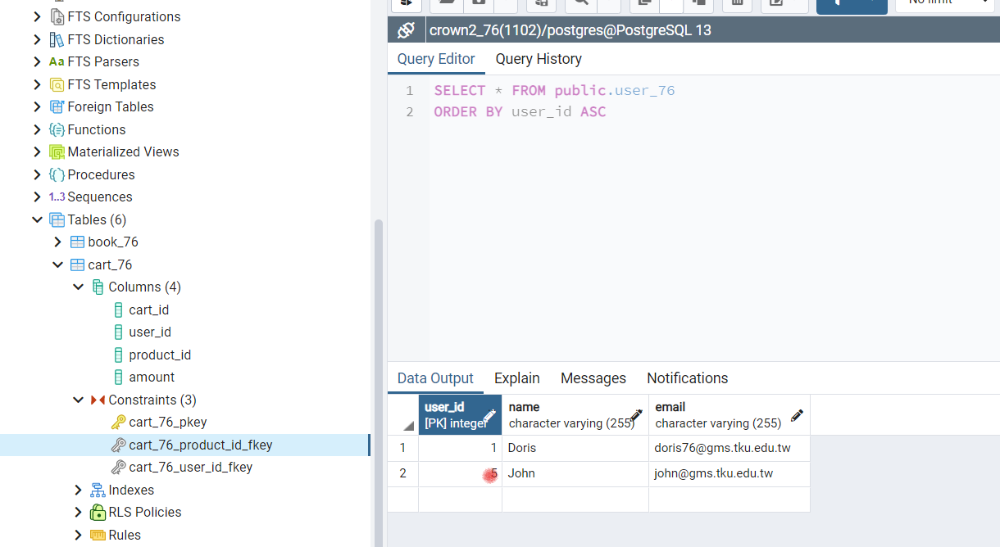
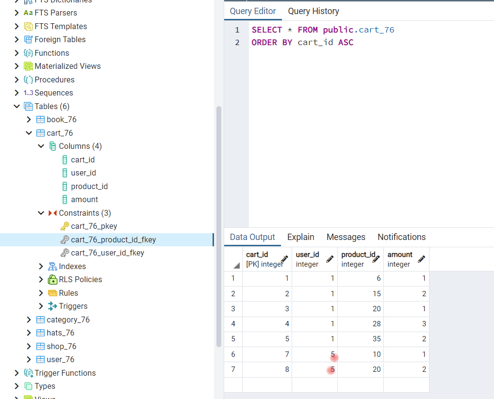

### w17-p5.2: test ON DELETE SET NULL

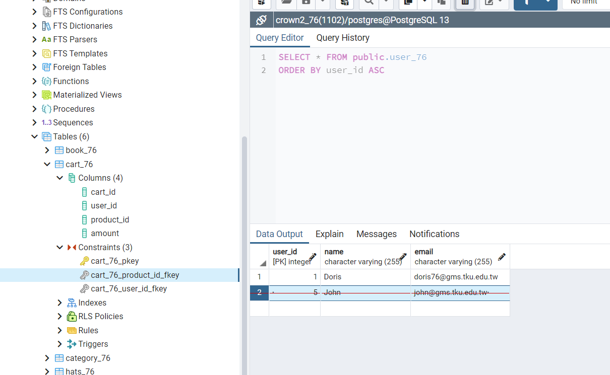
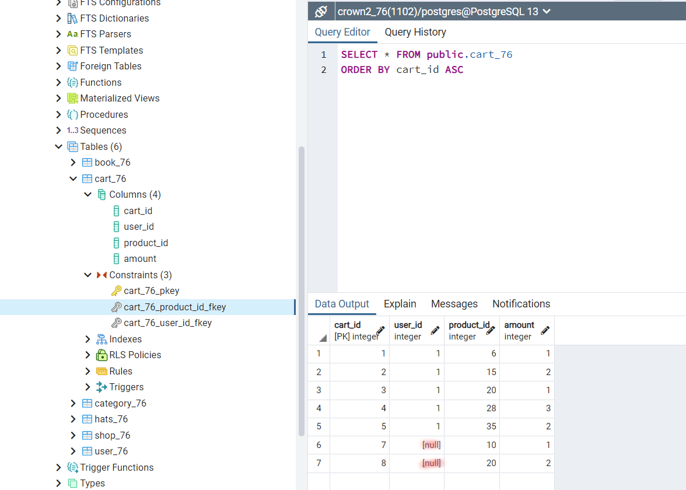

### w17-p6: implement /book_xx/delete/:id

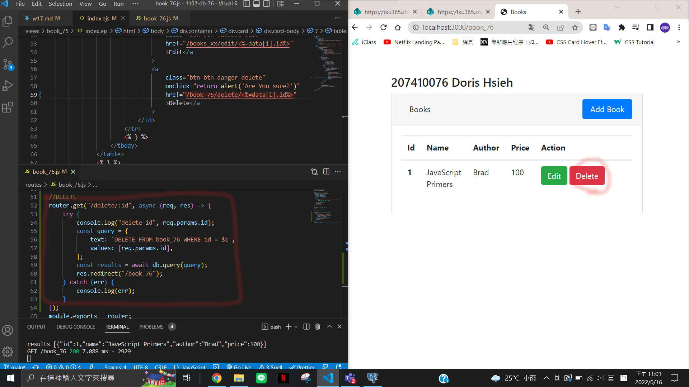

### w17-p7: implement /book_xx/update

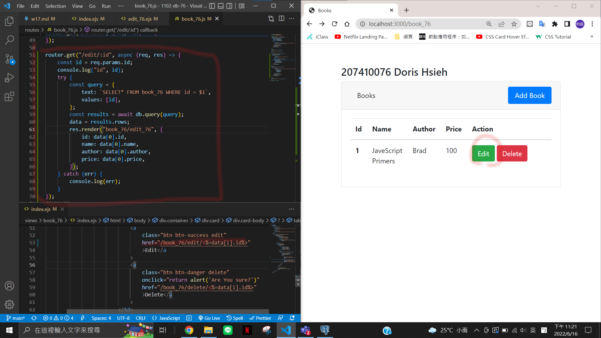
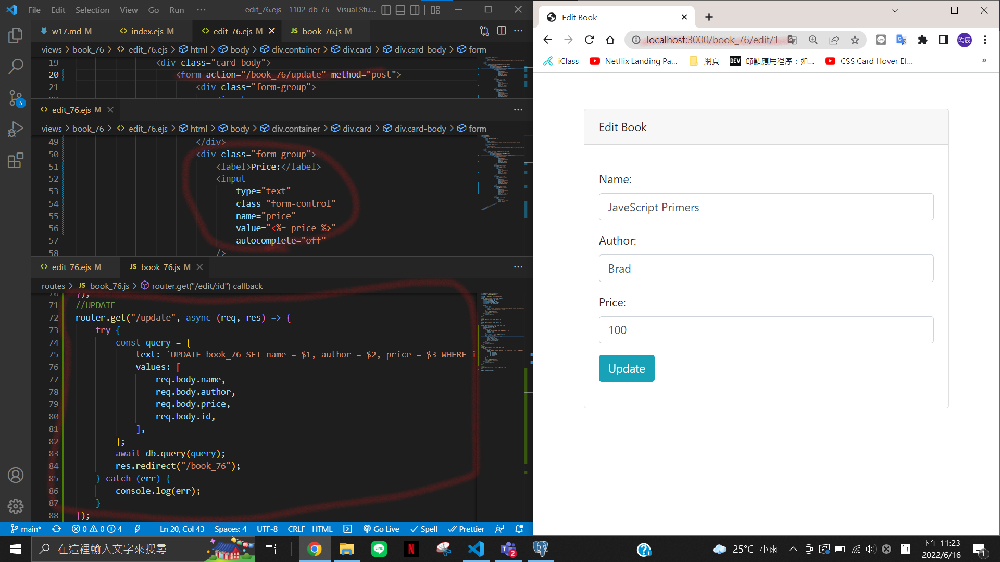

### last log

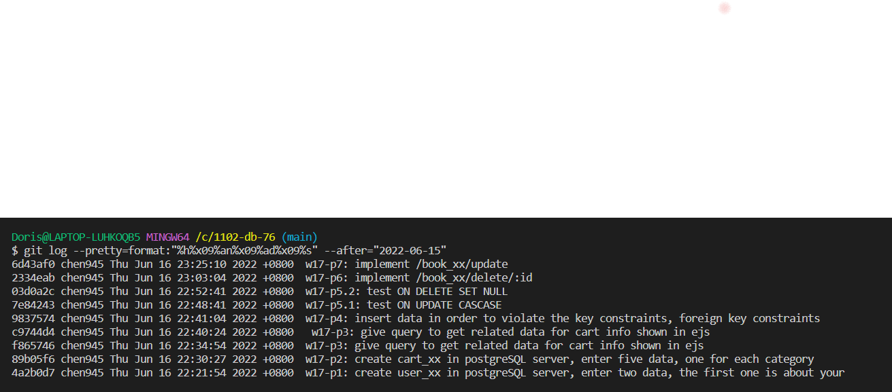

```
$ git log --pretty=format:"%h%x09%an%x09%ad%x09%s" --after="2022-06-15"
6d43af0 chen945 Thu Jun 16 23:25:10 2022 +0800  w17-p7: implement /book_xx/update
2334eab chen945 Thu Jun 16 23:03:04 2022 +0800  w17-p6: implement /book_xx/delete/:id
03d0a2c chen945 Thu Jun 16 22:52:41 2022 +0800  w17-p5.2: test ON DELETE SET NULL
7e84243 chen945 Thu Jun 16 22:48:41 2022 +0800  w17-p5.1: test ON UPDATE CASCASE
9837574 chen945 Thu Jun 16 22:41:04 2022 +0800  w17-p4: insert data in order to violate the key constraints, foreign key constraints
c9744d4 chen945 Thu Jun 16 22:40:24 2022 +0800   w17-p3: give query to get related data for cart info shown in ejs
f865746 chen945 Thu Jun 16 22:34:54 2022 +0800  w17-p3: give query to get related data for cart info shown in ejs
89b05f6 chen945 Thu Jun 16 22:30:27 2022 +0800  w17-p2: create cart_xx in postgreSQL server, enter five data, one for each category
4a2b0d7 chen945 Thu Jun 16 22:21:54 2022 +0800  w17-p1: create user_xx in postgreSQL server, enter two data, the first one is about your
```
