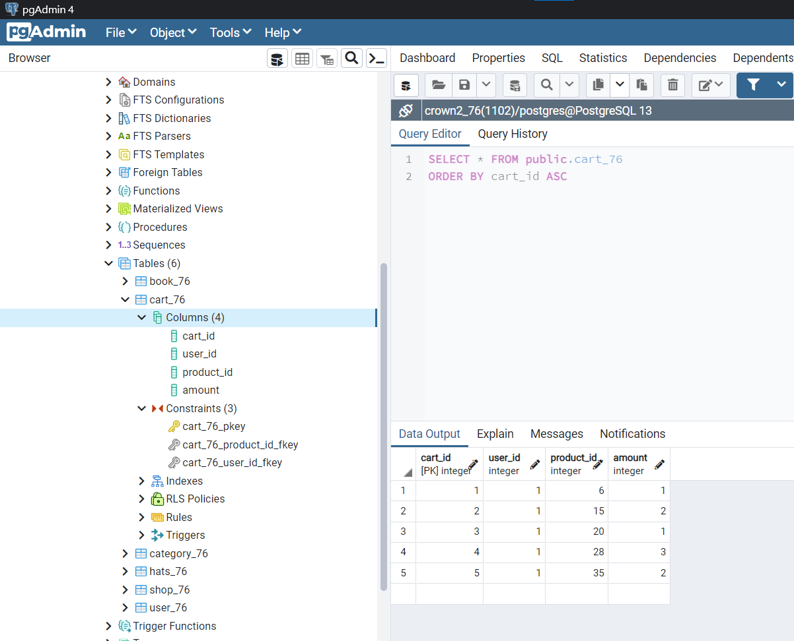

### w17-p1: create user_xx in postgreSQL server, enter two data, the first one is about your

### w17-p2: create cart_xx in postgreSQL server, enter five data, one for each category

### w17-p3: give query to get related data for cart info shown in ejs

